<!-- PROJECT LOGO -->
 

  

  <h3 align="center">Asim Mehta's Portfolio</h3>

  

    This is my portfolio!
     
    <a href="https://github.com/mehta-asim/Mehta_A_FIP/"><strong>Explore the docs »</strong></a>
     
     
    <a href="https://github.com/mehta-asim/Mehta_A_FIP/">View Demo</a>
    ·
    <a href="https://github.com/mehta-asim/Mehta_A_FIP/issues">Report Bug</a>
    ·
    <a href="https://github.com/mehta-asim/Mehta_A_FIP//issues">Request Feature</a>
  

<!-- TABLE OF CONTENTS -->

  
<h2 style="display: inline-block">Table of Contents</h2>

  <ol>
    <li>
      <a href="#about-the-project">About The Project</a>
      <ul>
        <li><a href="#built-with">Built With</a></li>
        <li><a href="research">Research</a></li>
      </ul>
    </li>
    <li>
      <a href="#getting-started">Getting Started</a>
      <ul>
        <li><a href="#prerequisites">Prerequisites</a></li>
        <li><a href="#installation">Installation</a></li>
      </ul>
    </li>
    <li><a href="#usage">Usage</a></li>
    <li><a href="#roadmap">Roadmap</a></li>
    <li><a href="#license">License</a></li>
    <li><a href="#contact">Contact</a></li>
  </ol>

## About The Project

This project is about showcasing the work that I have done in the past and the one that I will be doing in the future by building a website and putting it all on it.

### Built With

- [HTML 5](https://www.w3.org/TR/2008/WD-html5-20080122/)
- [CSS](https://www.w3.org/Style/CSS/Overview.en.html)
- [SASS](https://sass-lang.com/)
- [GULP](https://gulpjs.com/)
- [AJAX](https://developer.mozilla.org/en-US/docs/Web/Guide/AJAX/Getting_Started)
- [PHP](https://www.php.net/)
- [Javascript](https://www.w3schools.com/js/DEFAULT.asp)

### Research

<h3>Design</h3>
In terms of the design I wanted to go with a minimal look so that the focus goes on the work. 
<h2>Logo</h2>

 
<h2>Web Wireframes</h2>
<h3>Mobile Size</h3>
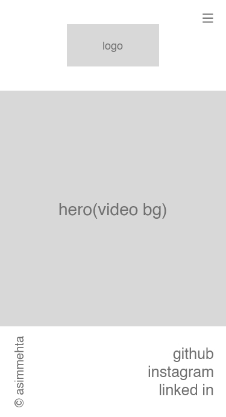
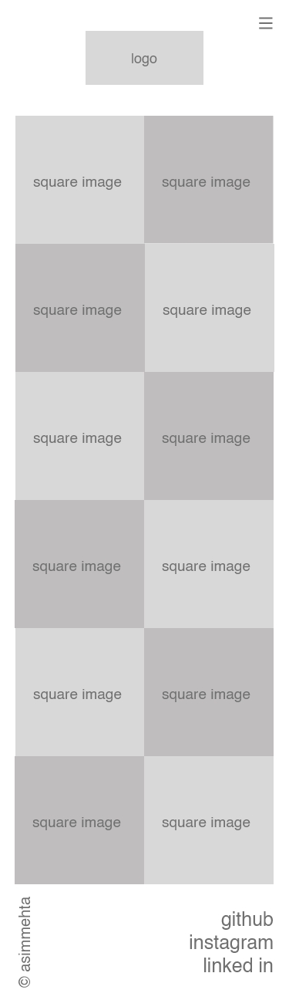
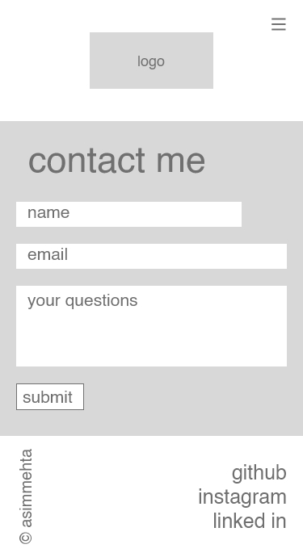
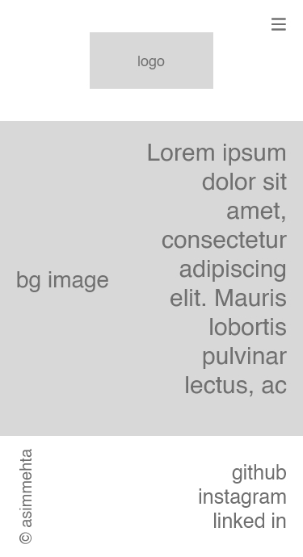
 
<h3>Web Size</h3>
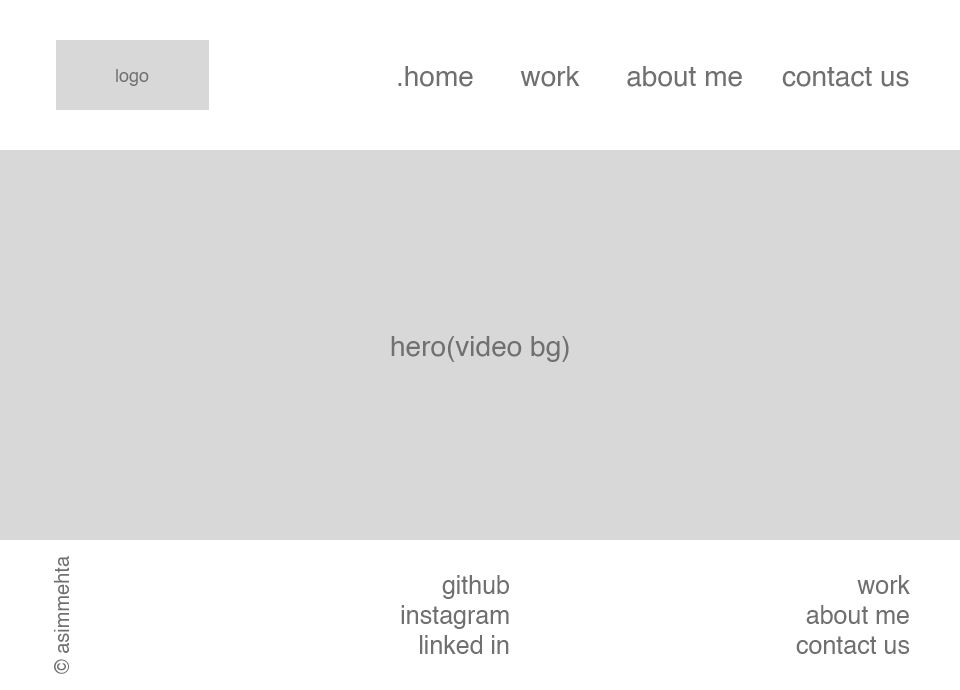
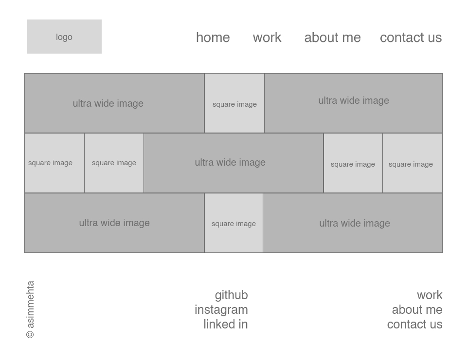
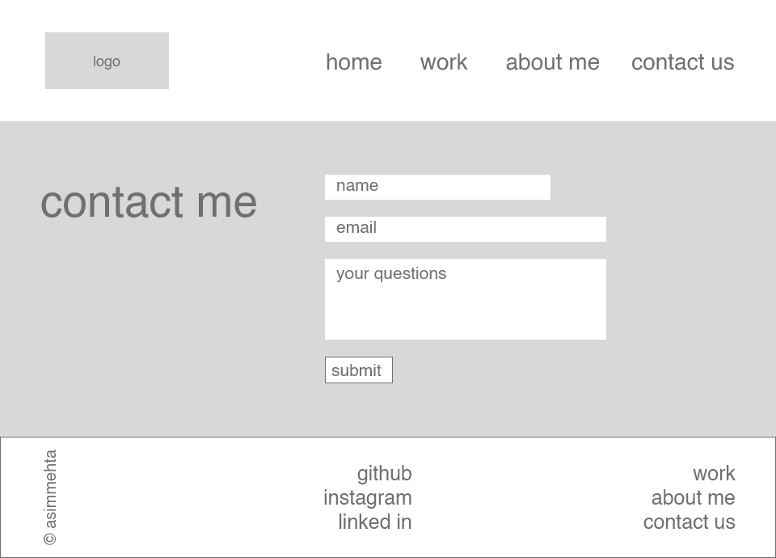
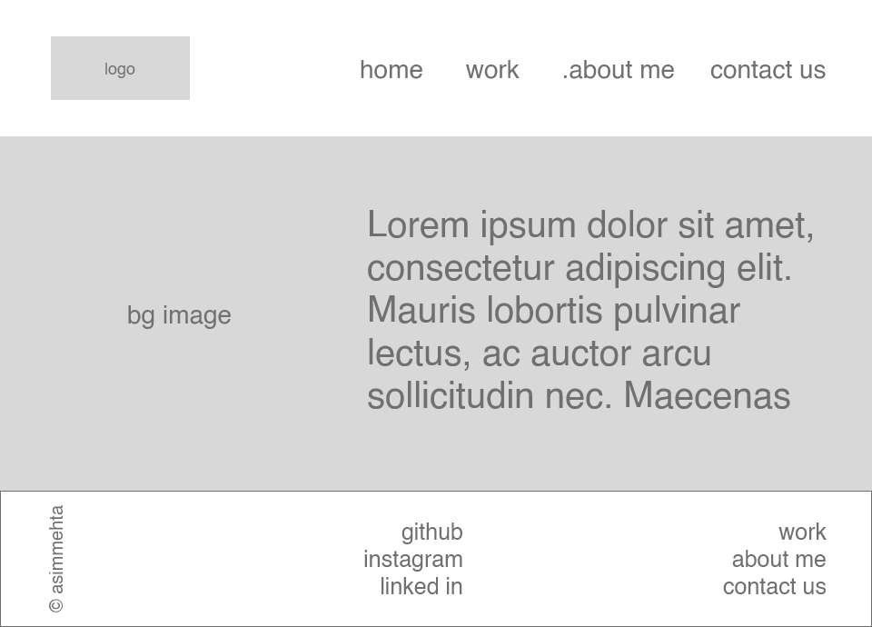
 
<h2>Web Design</3>
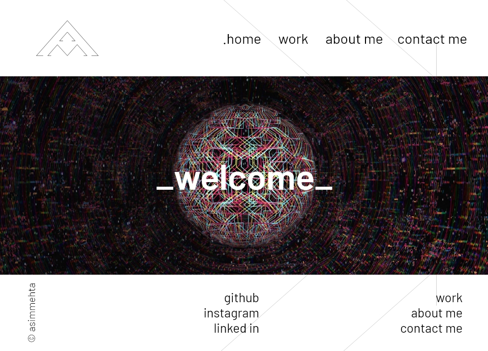
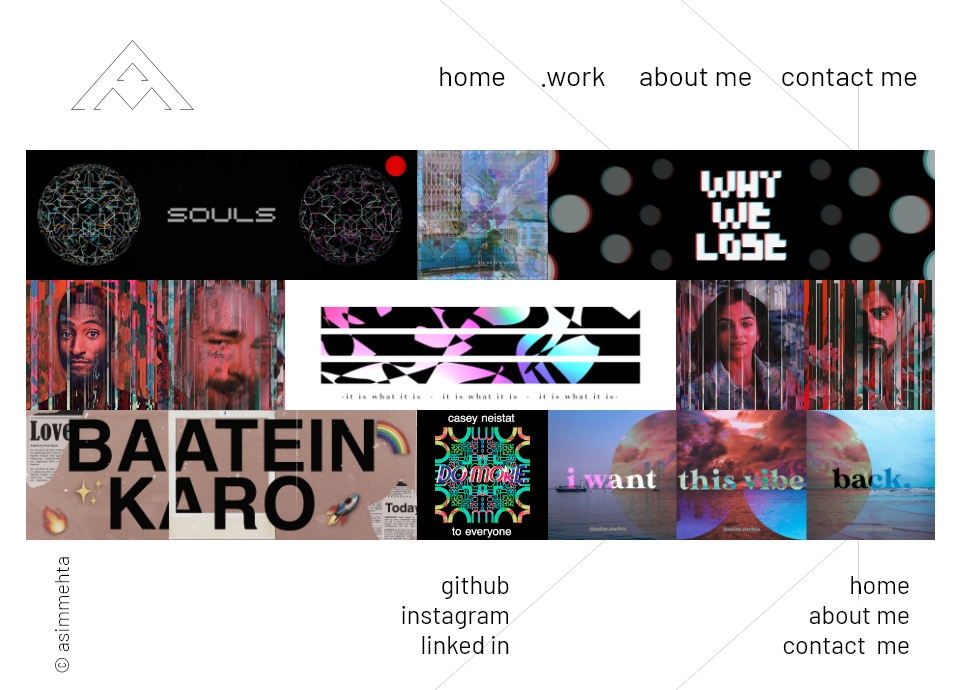
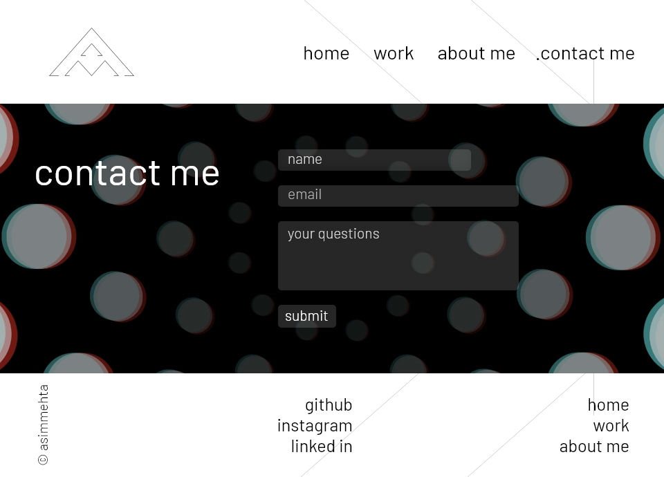
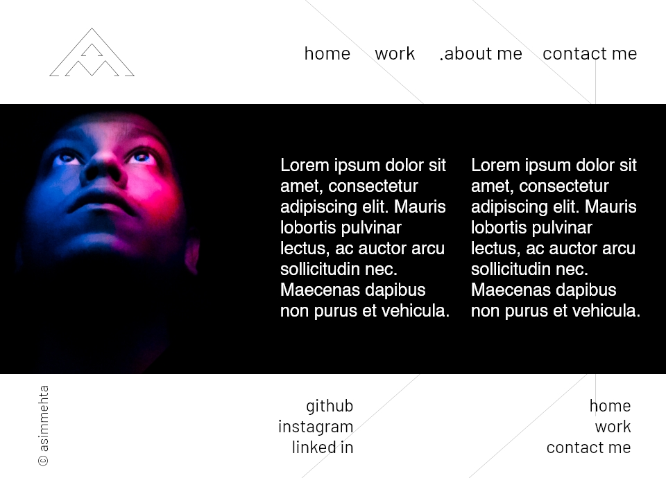

<!-- GETTING STARTED -->

## Getting Started

To get a local copy up and running follow these simple steps.

### Prerequisites

There are 2 things that you require for smooth functioning and viewing of the project 

<ul>
  <li>Web Browser</li>
  <li>Code Editor</li>
</ul>

### Installation

- [1.Install any Web Browser](https://www.google.com/search?q=download-web-browser)

- [2. Install any Code Editor](https://www.google.com/search?q=download-code-editor)

<!-- USAGE EXAMPLES -->

## Usage

After installation, you open the <code>index.html</code> in a web browser to view the webpage.

If you want to change something you can use the code editor to open any file and make the necessary changes.

<!-- You can inspect element and under console you can check the connection between SVG and Javascript as everytime you click on an icon the console returns with the id of the same. -->

_For more literature, please refer to the [Documentation](https://www.w3schools.com/html/html_editors.asp)_

<!-- ROADMAP -->

## Roadmap

See the [open issues](https://github.com/mehta-asim/Mehta_A_FIP/issues) for a list of proposed features (and known issues).

<!-- LICENSE -->

## License

Distributed under the MIT License. See `LICENSE` for more information.

<!-- CONTACT -->

## Contact

Asim Mehta 
Project Link: [https://github.com/mehta-asim/Mehta_A_FIP/](https://github.com/mehta-asim/Mehta_A_FIP/)
